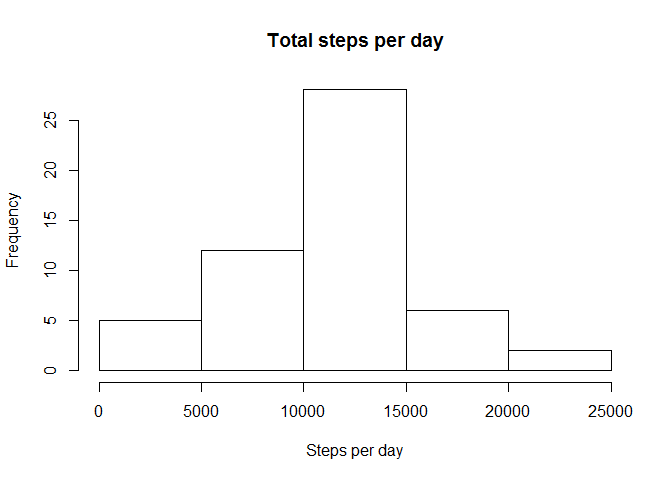
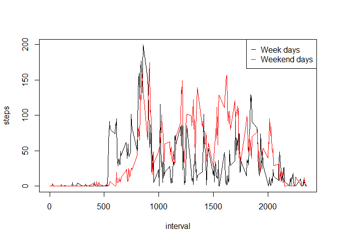

# Reproducible Research: Peer Assessment 1
## Loading and preprocessing the data
As a first step, let's read the data directly from the zip file in dcsv variable.

```r
dcsv <- read.csv(unz("activity.zip","activity.csv"))
```

Clean the NA's in steps in data variable.

```r
data  <- dcsv[!is.na(dcsv$steps),]
```


## What is mean total number of steps taken per day?

Calculate the total number of steps taken per day

```r
meanxday <- aggregate(steps ~ date, data, sum)
```

Make a histogram of the total number of steps taken each day

```r
hist(
    meanxday$steps, 
    main = "Total steps per day",
    xlab = "Steps per day"
)
```

 

Calculate and report the mean and median of the total number of steps taken per day

```r
mean(meanxday$steps)
```

```
## [1] 10766.19
```

```r
median(meanxday$steps)
```

```
## [1] 10765
```


## What is the average daily activity pattern?

Make a time series plot (i.e. type = "l") of the 5-minute interval (x-axis) and the average number of steps taken, averaged across all days (y-axis)

```r
plot(aggregate(steps ~ interval, data, mean), type = "l")
```

 


## Imputing missing values
Calculate and report the total number of missing values in the dataset

```r
sum(is.na(dcsv))
```

```
## [1] 2304
```

Devise a strategy for filling in all of the missing values in the dataset.

Use the mean of steps for filling the NA values. Separate a data frame with NA's, update the step field and combine with the data frame without NA's


```r
nadata <- dcsv[(is.na(dcsv$steps)),]
nadata$steps = mean(data$steps)

compdata  <- rbind(nadata, data)
```


## Are there differences in activity patterns between weekdays and weekends?


```r
Sys.setlocale("LC_TIME", "US")
```

```
## [1] "English_United States.1252"
```

```r
data$wd <- weekdays(as.Date(data$date))

wddata  <- rbind(data[(data$wd == "Monday"),],
                 data[(data$wd == "Tuesday"),],
                 data[(data$wd == "Tuesday"),],
                 data[(data$wd == "Tuesday"),],
                 data[(data$wd == "Tuesday"),]
                 )


wenddata  <- rbind(data[(data$wd == "Saturday"),],
                 data[(data$wd == "Sunday"),]
                 )


wddata$type  <- "Weekday"

wenddata$type  <- "Weekenday"

wdmean <- aggregate(steps ~ interval,wddata, mean )
wendmean <- aggregate(steps ~ interval,wenddata, mean )

plot(wdmean,type="l")
lines(wendmean,col="red")

legend("topright",legend=c("Week days","Weekend days"),pch=95,col=c("black","red"))
```

 
